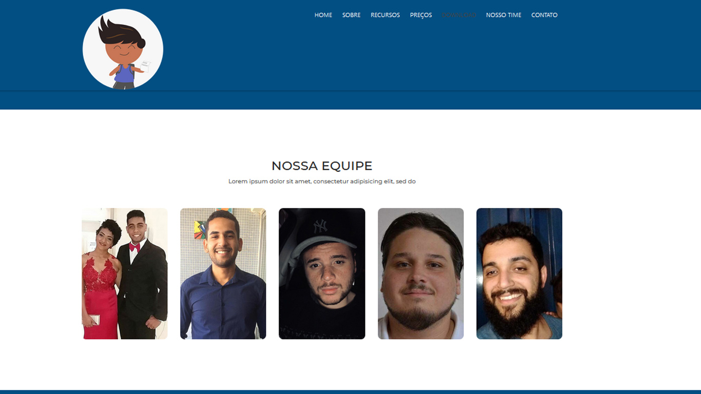

# Gestão Escolar Tech - Web

Aplicação para divulgação e Marketing do aplicação 
<a href="https://github.com/ricardotecnicob/gestaoescolartech_mobile">Gestão Escolar Tech - Mobile</a>

Desenvolvido em React JS para o Hackaton da Total Voice 2019 organizado pela Shawee.

## Descrição do Problema

Nosso Aplicativo vem de um problema bem comum entre as escolas: mal desempenho do fillho, a desconexão de pais e escola, a familia não liga ou não pode acompanhar o desempenho do seu filho na escola, as vezes por motivo dele não ter uma pessoa que o oriente ou ate mesmo pela dura realidade da familia ter que trabalhar 8h ou até mais de oito horas para trazer sustento para sua casa.

## A solução

Nossa solução busca aproximar a escola com pais de alunos. Com o aplicativo, cada pai poderá ter informações passadas de professores e diretores da escola como comunicados, desempenho, notas, se está indo bem, se passou mal e eventualidades com seu filho. Com isso é possível que o pai tenha um maior entendimento sobre a situação real do seu filho e aumentar a interação entre escola e pais.

## Imagens da Aplicação

Página inicial

Sobre

Recursos

Preços

Nosso Time

Download e Newsletter

Contato

## Instalação

Instale as dependencias necessárias.
console
yarn install ou npm install

## Execução

Na pasta raíz do projeto execute o metro bundler em um terminal.
console
yarn start

Abra [http://localhost:3000](http://localhost:3000) em seu browser.

## Time

- Ricardo Alves
- Leonardo
- Eduardo Quintino
- Espaker
- Felipe

## Licensa

MIT
